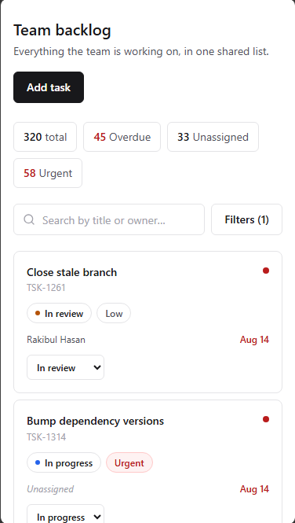
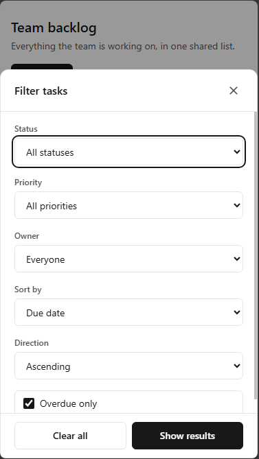
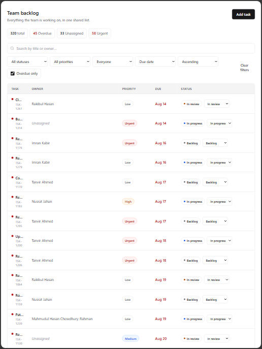
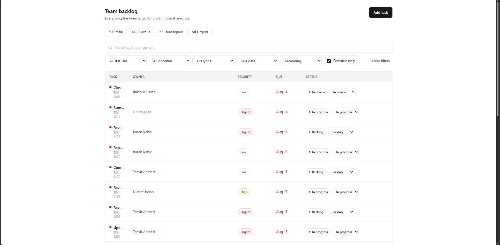

## Live Demo

🔗 **[View the live application](https://team-task-system-navy.vercel.app/)**

# Team Backlog — React Front-End Practical

A shared task list for an 8–15 person team, This is a single-page task management application built with React and TypeScript. It allows teams to view, search, filter, sort, and manage their work in one place — on any device.
---

## How to run it from a clean clone

```bash
# Clone the repository
git clone <repo-url>
cd taskSystem-frontend

# Install dependencies
npm install

# Run the dev server
npm run dev

# Open in browser
http://localhost:5173
```

**Production build**

```bash
npm run build
npm run preview
```

No database, no environment variables, and no setup beyond `npm install`. All data is generated in the browser with a seeded random generator, so the app is fully self-contained and reproducible on every reload.

---

## Screenshots

375px (mobile)
 
------------------------------------------------



768px (tablet)
 


1280px (desktop)


*(Filter drawer and task-detail modal shown separately below where relevant.)*

---

## Data model and why

```ts
interface Task {
  id: string;             // "TSK-1042" — short, stable, searchable
  title: string;          // required — the only field a task can't exist without
  description?: string;   // optional context; most tasks don't need one
  ownerName?: string;     // optional — "unassigned" is a real, common state
  status: TaskStatus;     // backlog | in-progress | review | done
  priority: TaskPriority; // low | medium | high | urgent
  dueDate?: string;       // optional — plenty of backlog work has no date yet
  createdAt: string;      // for sorting and "how stale is this" context
}
```

**Why this model**

- **`title`** is required — a task without a title isn't a task.
- **`description`** is optional — most backlog items don't need one; the title should be enough to identify it.
- **`ownerName`** is a plain string, not a user object — there's no authentication or team directory here, so a name is enough to filter, search, and display.
- **`status`** has four stages — Backlog → In Progress → In Review → Done. This is close to the minimum that's still honest about how work actually moves.
- **`priority`** has four levels — Low, Medium, High, Urgent — enough granularity without overwhelming the reader.
- **`dueDate`** is optional — forcing a date on every task would just encourage fake dates.
- **`createdAt`** is required — used for sorting by newest first and understanding how stale a task is.

**What I left out, and why**

| Field                    |                      Why it's not here                                                                          |
|--------------------------|-----------------------------------------------------------------------------------------------------------------|
| Tags / labels            | Adds complexity without answering the brief's core questions - what's urgent, who owns this, can I find it fast |
| Comments / activity log  | Nice to have, but not needed for core backlog functionality                                                     |
| Sub-tasks                | A task is the smallest unit of work in this model; sub-tasks would add a second entity type                     |
| Assignee avatars         | Would require a user model — `ownerName` is enough                                                              |
| Custom fields            | Would add filtering/UI complexity the brief doesn't ask for — it values clarity over configurability            |

**Workflow stages — why four, and why not five**

`Backlog → In Progress → In Review → Done`

- **Backlog** — waiting to be picked up
- **In Progress** — actively being worked on
- **In Review** — done, but waiting on someone else's judgement
- **Done** — finished

I didn't add a fifth **"Blocked"** stage. Blocked work is better represented as an *urgent/overdue flag* on whatever stage it's actually stuck in, rather than a place it teleports to — a blocked task is still, physically, "in progress" or "in review."

**Test data**

`generateTasks.ts` uses a seeded random generator to produce 320 tasks, deliberately built to stress-test the layout rather than flatter it:

- Titles ranging from a few words to far longer than the layout comfortably fits
- Tasks missing an owner, a due date, or a description
- Dates spanning overdue, due today, and far in the future
- At least one inconveniently long name (*Mahmudul Hasan Chowdhury-Rahman*)

---

## Product decisions

**Layout: a table that becomes cards, not a board**

The brief's own priorities — *find something in seconds*, *see what's urgent without reading every row*, *filter and share a view* — are list operations: search, sort, scan. A Kanban board suits a small number of items you move by feel; this brief describes hundreds of items with real metadata, which is what tables are for.

**Mobile adaptation** — at 768px and above, a dense table. Below 768px, the same data as a stack of cards. Same fields, same actions — nothing disappears on a phone.

**First screen** — everything lives on one page, nothing important is hidden behind a click:

- Header with title + "Add task"
- Stats strip — Overdue / Unassigned / Urgent counts, each clickable to apply that filter
- Search bar — searches by title, ID, or owner name
- Filter row — Status, Priority, Owner, Sort, Direction, Overdue-only (desktop)
- Task list — table (desktop) or cards (mobile)
- Pagination — 20 items per page

**Mobile filtering** — a single "Filters" button opens a bottom sheet with every control stacked vertically, rather than a row of dropdowns squeezed onto a small screen. The button shows an active-filter count, so it's clear before opening whether anything is applied.

**Status changes** — a small `<select>` sits next to the status badge everywhere a task appears (table row, card, detail modal). It's instantly usable with a keyboard, a screen reader, or a thumb, and needed no extra library.

---

## What I decided not to build, and why

| Feature                      |                                              Why                                    |
|------------------------------|-------------------------------------------------------------------------------------|
| Backend                      | The brief is explicit that a frontend-only submission with mocked data can score full marks — the time budget was better spent on the interface |
| Drag-and-drop board          | A native `<select>` is more accessible, more robust on mobile, and avoids pulling in a DnD library |
| Authentication / permissions | Out of scope for a single-team backlog with no stated access-control requirement |
| Virtualized list             | At ~320 rows with pagination (20/page), the DOM never gets large enough for virtualization to matter — I'd revisit this if a real backlog ran into the thousands |
| Infinite scroll              | Pagination keeps the URL state simple and the back button predictable |

---

## Decisions I'm least confident about

**1. Table-first instead of board-first**
The brief's line "work moves through stages, and moving it is quick" could argue for a Kanban board as the primary view. I chose table + cards because the shareable-URL and fast-scanning requirements read more strongly to me.
*Alternative:* a board view with the same URL-driven filters is a real alternative worth prototyping.

**2. Pagination instead of infinite scroll**
Pagination keeps the URL state simple and the back button predictable, but infinite scroll might feel more natural for the "scan between meetings" use case the brief describes.
*Alternative:* I'd want to watch someone actually use it on a phone before deciding either way.

**3. Stats strip doubling as filter shortcuts**
Clicking "3 overdue" applies the overdue filter, rather than being a plain read-only summary. It's convenient, but it's also a bit of hidden behaviour — nothing on the button visually says "click to filter."
*Alternative:* a plain, non-clickable summary would be more predictable but less useful.

*(A smaller, related note: the status `<select>` inside each desktop table row sits inside a row that's also keyboard-focusable as a whole — functionally fine and fully keyboard-operable, but technically a nested-interactive-element pattern I chose not to restructure within scope.)*

---

## What I used AI tooling for

I used Claude as a coding assistant for:

- Scaffolding repetitive component boilerplate — badge components (`StatusBadge`, `PriorityBadge`), shared button/input primitives, and the `FilterFields` component
- Sanity-checking the URL-state hook's edge cases — empty params, invalid enum values in the query string, back-button behaviour
- Generating realistic mock data — `generateTasks.ts` uses a seeded generator to produce the 320-task dataset described above
- Reviewing responsive breakpoints — confirming the table-to-cards switch happens at the right width and nothing clips at any size
- Reviewing and hardening keyboard accessibility — adding a proper focus trap to the filter drawer and task-detail modal, so Tab stays inside an open dialog and focus returns to the trigger button on close

**My involvement:** the data model, filtering/sorting logic, responsive breakpoints, and every product decision above were reviewed, understood, and can be walked through and modified line by line. AI was used as a coding assistant, not a replacement for the decisions themselves.

---

## Known trade-offs / what I'd do next with more time

- Add a real virtualized list once the dataset is large enough to actually need it
- Debounce rapid filter changes before they hit the URL — search is already debounced 250ms, but toggling several filters quickly still pushes a history entry per change
- Restructure the table row's status `<select>` to avoid the nested-interactive-element pattern noted above
- Expand the status control to a full custom listbox with type-ahead, if richer keyboard interaction were ever needed